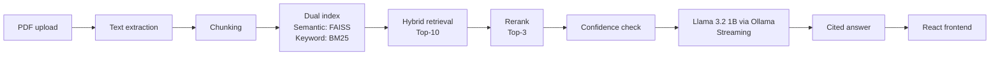

# Campus Handbook Bot

Edge-Optimised On-Device RAG System for Institutional Document Q&A

**Team:** Titans  
**Authors:** Gaurav Chaurasia, Bittu Prajapati

## Overview

Campus Handbook Bot is a fully on-device retrieval-augmented generation (RAG) system that lets students and staff ask plain-English questions about institutional documents such as handbooks, fee structures, exam schedules, hostel rules, and policy documents.

Users upload a PDF, ask a question, and receive a direct answer with the exact source cited. The entire pipeline runs locally on NVIDIA Jetson Orin Nano using Llama 3.2 1B, with no internet dependency and no data leaving the device.

## Use Cases

- Students getting instant answers from long handbooks without reading hundreds of pages.
- Administrative staff quickly looking up policies during student interactions.
- Institutions with privacy requirements where documents cannot be sent to external cloud services.
- Low-connectivity campuses needing a reliable offline knowledge assistant.

## Key Features

- Smart search: finds the right answer whether the question is broad or tied to a specific rule number.
- Honest answers: if the answer is not in the document, the system says so instead of inventing one.
- Best results first: ranks retrieved content before generation so the model only sees relevant context.
- Fast replies: streams the answer word by word instead of waiting for the full generation to finish.
- Always ready: indexed documents persist across reboots, so re-uploading is not required.
- Cited answers: every response shows exactly which document and section it came from.

## Architecture



The pipeline combines semantic and keyword search, reranks the best matches, checks confidence, and then generates a cited response through a local LLM.

## Tech Stack

| Layer | Tool | Role |
|---|---|---|
| LLM | Llama 3.2 1B, Ollama, Q4_K_M quantization | On-device generation with streaming output |
| Dense Search | FAISS, all-MiniLM-L6-v2 | Semantic similarity retrieval |
| Sparse Search | BM25, rank-bm25 | Keyword and exact-match retrieval |
| Reranking | cross-encoder/ms-marco-MiniLM-L-6-v2 | Precision rerank of top-10 to top-3 |
| RAG Framework | LlamaIndex | Chunking, hybrid retrieval, prompt assembly |
| PDF Parsing | PyMuPDF | Text extraction from institutional PDFs |
| Backend | FastAPI (async) | Ingest and query REST API, background tasks |
| Frontend | React + Vite | Upload UI, streaming chat, citation display |
| Deployment | Docker Compose | One-command local and Jetson deployment |

## Why On-Device

- Privacy: documents remain on the local device.
- Reliability: the system works without internet access.
- Speed: local retrieval and generation reduce cloud round-trips.
- Control: institutions keep full ownership of their data and workflow.

## Project Goal

The goal of this project is to provide a practical, private, and offline document question-answering assistant for campuses and institutions. It is designed for documents that are frequently referenced but time-consuming to search manually.

## Project Setup Guide

### 1) Prerequisites

- Python 3.10 or newer
- A local Ollama install with the target model available
- `pip` and `venv`

If you are using Ollama, pull the model once before starting the API:

```bash
ollama pull llama3.2:1b
```

### 2) Clone and enter the project

```bash
git clone https://github.com/Gaurav6174/edgeAI_RAG.git
cd edgeAI_RAG
```

### 3) Create and activate a virtual environment

```bash
python3 -m venv .venv
source .venv/bin/activate
```

### 4) Install dependencies

```bash
pip install -r requirements.txt
```

### 5) Configure environment variables

Create a `backend/.env` file with the local paths and model settings used by the app:

```env
EMBED_MODEL=sentence-transformers/all-MiniLM-L6-v2
INDEX_DIR=../data/index
UPLOAD_DIR=../data/uploads
OLLAMA_HOST=http://localhost:11434
OLLAMA_MODEL=llama3.2:1b
TOP_K=10
RERANK_TOP_N=3
```

### 6) Start the backend API

The backend imports modules relative to the `backend/` directory, so start it from there:

```bash
cd backend
uvicorn main:app --reload --host 0.0.0.0 --port 8000
```

### 7) Upload a PDF and build the index

Send a PDF to the ingest endpoint to create the FAISS and BM25 indexes:

```bash
curl -F "file=@/path/to/handbook.pdf" http://localhost:8000/ingest
```

### 8) Ask a question

Once ingestion is complete, query the backend:

```bash
curl -X POST http://localhost:8000/query \
    -H "Content-Type: application/json" \
    -d '{"question":"What is the hostel fee refund policy?"}'
```

### 9) Check citations

Use the citations endpoint to inspect the supporting chunks returned for a question:

```bash
curl "http://localhost:8000/citations?question=What%20is%20the%20hostel%20fee%20refund%20policy%3F"
```

## Deployment Concept

The architecture is designed for containerised deployment with Docker Compose, making it suitable for both local development and edge deployment on Jetson hardware.
